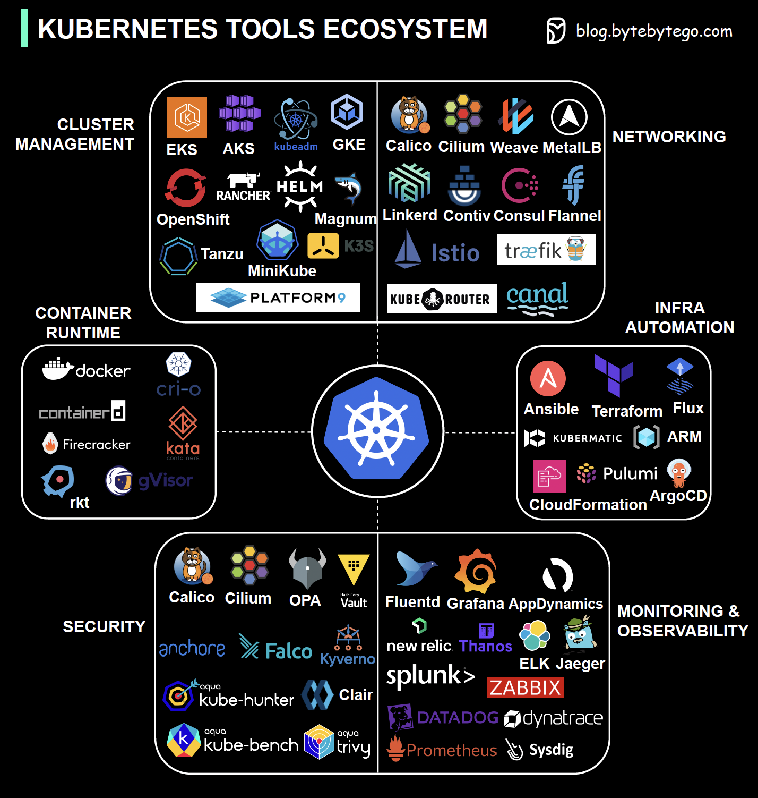

# AI 시대 개발자의 인프라
## 1-1. 개발자에게 인프라가 다가온 시대 

- 2010년 이전에는 당연히 코드 개발팀과 운영(인프라)팀이 별도로 있었습니다.


- 클라우드와 컨테이너가 보편화되며 DevOps 문화가 퍼지게 되었습니다. 이제 개발팀이 운영 환경, 장애 대응, 파이프라인 구성까지 맡게 됩니다.

  
- 클라우드 네이티브로 전환되며 인프라팀은 수백대의 서버를 다루게 되었고 `Code-As-Infra` 즉 YAML 기반의 Terraform - Git 파이프라인을 구성하는 것이 일반화 되었습니다.

그렇다고 인프라 없이 모든 것을 해야하는 것은 아닙니다. 하지만 개발자는 아래 질문에 대답할 수 있어야 합니다.
```aiignore
이 서비스를 어떻게 테스트하고 배포하지? (CI & CD)
장애가 나면 어떻게 알지? (모니터링)
트래픽이 늘면 어떻게 대응하지? (스케일아웃)
```

<br>

## 1.2 Kubernetes, 클라우드 인프라의 공통 언어

개발자가 인프라를 처음 배울 때에는 Kubernetes(K8S) 는 좋은 출발점입니다.
- 특정 클라우드에 종속되지 않습니다. 어딜 가든 운영 방식은 동일합니다
  - `AWS EKS(Elastic Kubernetes Service)`, `GKE(Google Kubernetes Engine)`, `AKS(Azure Kubernetes Service)`  
  
  
- 일종의 클라우드를 위한 운영 체제입니다.
  - `리눅스가 하드웨어에 프로세스, 파일, 네트워크`를 다루 듯 `K8S는 배포, 네트워킹, 스토리지, 보안`을 추상화 합니다.  
  
  
- 핵심 개념이 각 클라우드 인프라와 겹칩니다.
  - Deployment, Pod - 배포
  - Service, Ingress -  트래픽 라우팅
  - ConfigMap, Secret - 설정과 시크릿
  - HPA, Resource Limit - 리소스와 규모
  - Monitoring, Logging - 모니터링

### GitOps


GitOps는 Git 을 Single Source Of Truth 로 관리하는 방법을 의미합니다. 배포, 히스토리, 롤백을 코드로 관리하고 리뷰 받을 수 있습니다.
- 원하는 상태를 YAML로 Git Push 하면 도구가 알아서 그 상태로 맞춥니다. 
- 이는 ArgoCD 나 Flux 와 GitOps 같은 도구들이 Git 을 주기적으로 확인하여 클러스터에 적용합니다.
- 누군가 클러스트를 수동으로 바꾸면 GitOps 도구들이 원래 상태로 되돌립니다.

물론 GitOps를 사용해도 K8S는 학습 곡선이 가파른 편입니다. 수백 개의 프로젝트에 각 영역마다 선택지가 엄청납니다. 선택했다면 그 도구들의 사용법을 숙지하고 대시보드, 규칙을 각각 설정해야합니다.  



<br>

## 1.3 GitOps에서 GitAIOps 로

GitOps 를 사용해도 결국 그 상태를 정의하고 점검하는 건 사람의 몫이었습니다. 하지만 2026년에는 많은 것이 AI로 대체 가능해졌습니다.  
이제 `자연어로 지시하면 Git에 선언되고 자동 반영된다` 가 가능합니다.

| 항목    | GitOps | GitAIOps |
|-------| --- | --- |
| 상태 정의 | 사람이 Kubernetes YAML, Helm values, Kustomize 등을 직접 작성 | Claude Skill 또는 AI agent가 요구사항을 바탕으로 YAML/Helm values를 생성 |
| 배포    | Git에 선언된 상태를 Argo CD/Flux가 클러스터에 동기화 | 배포 방식은 동일하게 GitOps 도구를 사용. AI는 manifest 생성, 변경 제안, 검증을 보조 |
| 트러블슈팅 | 사람이 로그, 이벤트, 메트릭을 직접 확인하고 원인을 분석 | AI가 로그, 이벤트, 메트릭을 분석하고 원인 후보와 조치안을 알림/이슈/문서로 연동 |
| 문서화   | 사람이 별도 문서를 작성하고 최신 상태를 직접 유지 | AI가 변경사항, 장애 대응, 운영 절차를 자동 문서화하고 인덱싱 |
| 검증    | 사람이 `kubectl`, 대시보드, 테스트 결과를 수동 확인 | AI가 Git 선언 상태와 클러스터 실제 상태를 실시간 비교하고 drift/이상 상태를 감지 |
| 코드 리뷰 | 사람이 PR diff를 읽고 위험도를 판단 | AI가 manifest diff, 보안 설정, 리소스 요청량, 의존성 변화를 함께 리뷰 |
| 문서화   | 장애 기록과 운영 노하우가 사람의 문서화 습관에 의존 | 장애, 배포, 수정 이력이 자동으로 지식베이스에 누적 |
| 목표    | Git을 단일 진실 공급원으로 삼아 배포를 선언적으로 관리 | GitOps에 AI 분석/생성/검증/문서화를 결합해 운영 루프를 지능화 |

## 1.4 실습 환경 구성
여러분은 Notiflex 의 DevOps 엔지니어입니다. 실습환경은 GKE 를 권장합니다만 AWS, AKS, 온프렘도 가능은 합니다.  

| 저장소               | 역할                           |
|-------------------|------------------------------|
| [_book-gitaiops](https://github.com/sysnet4admin/_Book_GitAIOps)    | 가이드 저장소, 가드레일, 의사결정 가이드 및 설명 |
| [notiflex-platform](https://github.com/sysnet4admin/notiflex-platform) | 직접 생성하고 실습하며 채워가는 저장소        |

| 단계 | 설명 |
| --- | --- |
| [2장] 창업 | Notiflex를 만들었다.<br>GKE 위에 API 서버 하나를 올린다. |
| [3장] 첫 고객 | 배포할 때마다 긴장된다.<br>Argo CD로 GitOps를 도입한다. |
| [4장] 서비스 장애 | 새벽에 고객이 "알림이 안 온다"고 연락했다. 뭐가 문제인지 모르겠다.<br>관측 가능성(observability)을 구축한다. |
| [5장] 성장 시작 | 고객이 늘면서 배포할 때마다 서비스가 끊긴다.<br>무중단 배포를 도입한다. |
| [6장] 전환기 | 더 많은 고객이 들어오면서 응답이 느려지고 보안에 우려가 생긴다.<br>캐시, 시크릿 관리, 배포 전략을 정비한다. |
| [7장] 대형 계약 | 대형 고객사가 전용 환경을 요청한다.<br>인프라를 확장하고 테넌트를 분리한다. |
| [8장] 대규모 운영 | 서비스 간 호출이 꼬이고, 배치가 밀린다.<br>이벤트 드리븐, 분산 트레이싱, 배치 자동화를 도입한다. |
| [9장] 돌아보기 | 여기까지 오는 동안 깃에 쌓인 코드, 설정, 문서를 본다.<br>이것이 살아있는 운영 표준, GitAIOps다. |


`_book-gitaiops`의 가드레일을 활용해서 AI와 함께 진행하는 것을 권장합니다.

- [decision-guides](../gitaiops/_book-gitaiops/decision-guides) - 도구 선택의 근거와 대안 비교
- [prompt-guardrails](../gitaiops/_book-gitaiops/prompt-guardrails) - 실행 지침, 사전 조건, 단계별 절차, 트러블슈팅
- [result-templates](../gitaiops/_book-gitaiops/result-templates) - 검증 체크리스트와 실행 결과 확인

