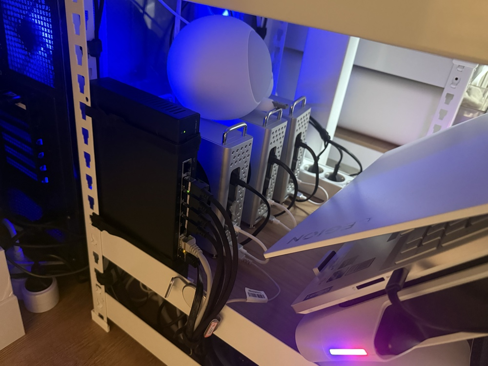
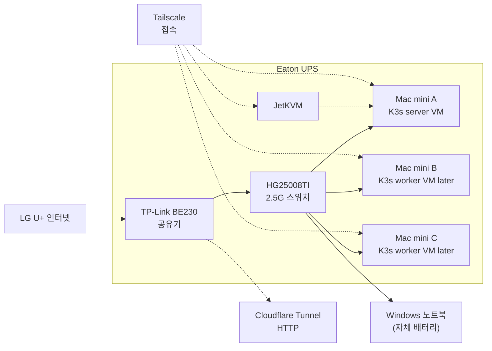
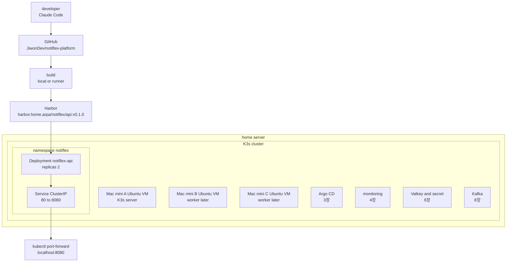

# 02 GKE 대신 홈서버 K3s 환경구성

> ⚠️ 환경 설정은 책이랑 아무 관련 없습니다. 개인용이니 참고만 해주세요.

책의 2장은 GCP 인증에서 시작해 GKE 클러스터를 만들고, 그 위에 첫 앱을 배포하는 흐름입니다
여기서는 같은 목표를 홈서버로 옮깁니다


| 기준 | 선택                                            |
| --- |-----------------------------------------------|
| 실행 환경 | GKE가 아니라 홈서버                                  |
| 서버 장비 | Mac mini M4 32G 3대, 윈도우 노트북 32G 1대            |
| 가상화 | Mac은 VMware Fusion 25H2u1 이상, Windows는 VMware Workstation Pro |
| 게스트 OS | Mac VM은 Ubuntu Server 24.04.4 ARM64, Windows worker VM은 Ubuntu Server 24.04 LTS amd64 |
| Kubernetes | K3s                                           |
| 이미지 저장소 | Harbor                                        |
| 관리 접속 | Tailscale, SSH, kubeconfig                    |
| 외부 공개 | Cloudflare Tunnel        |

<br>

## 2.1 홈서버 하드웨어 구조

맥미니로 홈서버 구성은 굉장히 비싼 구성(~~홈서버로 치고는 돈 지랄~~)이 맞습니다.  
여러 고민을 해봤는데, 미쳐버린 RAM 가격과 전력과 에어컨 없이(여름 제외) 24시간 켜 둘 서버로는 Mac mini가 나름 가성비더라구요.  
애플의 30% 가격 인상 덕분에 2년쯤 쓰고 팔아도 감가가 없으니 매달 나가는 클라우드 비용을 장비로 바꿔 묶어 둔 셈입니다.




| 고민 | 선택 | 이유                                       |
| --- | --- |------------------------------------------|
| Mac mini M4 | 선택 | 전력 대비 성능이 좋고, RAM 32G 구성이 가능하며 중고가 방어가 좋음 |
| 2.5G 스위치 | 선택 | Longhorn 복제, 이미지 pull, 로그 수집 트래픽을 LAN 안에서 처리 |
| UPS | 선택 | 집 전기가 끊길 때 VM과 host가 정상 종료 및 알람 시간 확보    |
| JetKVM | 선택 | SSH와 네트워크가 꼬였을 때 마지막 콘솔 경로 확보            |

| 계층 | 구성                    | 역할 |
| --- |-----------------------| --- |
| 회선 | 1G, 1일 QoS 300G       | 현재 인터넷 회선 |
| 공유기 | TP-Link BE230 2.5G    | DHCP, NAT, Wi-Fi, LAN 기준점 |
| 스위치 | HG25008TI 2.5G 8포트    | 서버와 작업 단말을 2.5G LAN으로 연결 |
| UPS | Eaton Ellipse ECO 650 | 공유기, 스위치, JetKVM, Mac mini 3대 보호 |
| 원격 콘솔 | JetKVM                | OS나 네트워크가 꼬였을 때 화면과 키보드 접근 |
| 서버 | Mac mini M4 32G 3대    | K3s VM을 올릴 기본 서버 |
| 보조 worker | Windows 노트북 32G       | 필요할 때만 붙이는 worker 후보 |

### 하드웨어 구조




<br>

## 2.2 네트워크와 외부 진입로

노드가 여러 대가 되면 내부 통신이 늘어납니다.
단일 K3s server로 시작하지만, 뒤에서는 Argo CD, monitoring, Valkey, Kafka, Longhorn까지 붙습니다
이미지 pull, Longhorn 복제, 로그 수집, monitoring 트래픽이 LAN 안에서 계속 생기기 때문에 서버 쪽은 처음부터 2.5G로 묶습니다

DHCP와 주소 예약은 공유기에서 관리하고, VM은 bridged mode로 LAN에 직접 붙입니다
이렇게 두면 K3s node가 공유기에서 독립된 장비처럼 보이고, host IP와 VM IP도 분리됩니다


| 고민 | 선택 | 이유                                    |
| --- | --- |---------------------------------------|
| 공유기 포트포워딩 | 보류 | 간단하지만 집 안쪽 관리 서비스까지 노출될 수 있음          |
| 고정 IP | 보류 | 외부 allowlist가 필요해질 때 다시 검토 |
| Tailscale | 선택 | SSH, kubeconfig, 관리 콘솔을 사설 관리망 안에 둠   |
| Cloudflare Tunnel | 선택 | 공개가 필요한 HTTP 서비스만 밖으로 연결              |

홈서버는 물리 장비, VM, Kubernetes Service, LoadBalancer VIP가 한 LAN 안에 같이 보입니다 . 아래와 같이 IP 대역을 나눕니다.

| 항목 | 선택 |
| --- | --- |
| LAN 대역 | `192.168.0.0/24` |
| gateway | 공유기 |
| 주소 고정 | 공유기 DHCP reservation |
| 스위치 | 2.5G unmanaged |
| VM 네트워크 | VMware bridged mode |
| 관리망 | Tailscale |

| 대역 | 용도 | 이유                                |
| --- | --- |-----------------------------------|
| `192.168.0.1` | gateway | 공유기 기준점                           |
| `192.168.0.10` | 원격 콘솔 | JetKVM은 서버보다 먼저 찾아야 하므로 낮은 번호에 고정 |
| `192.168.0.11~19` | 물리 host | Mac mini, Windows host 같은 실제 장비   |
| `192.168.0.101~109` | K3s VM | host와 VM을 분리 구분                   |
| `192.168.0.150~240` | MetalLB VIP | 서비스용 IP                           |


현재 내부 IP는 공유기 DHCP reservation 기준으로 아래처럼 잡습니다
여기서 `192.168.0.11~14`는 물리 host 주소이고, K3s VM은 bridged mode로 별도 IP를 받습니다

| 장비 | 내부 IP | 역할 |
| --- | --- | --- |
| 공유기 | `192.168.0.1` | gateway, DHCP |
| JetKVM | `192.168.0.10` | 원격 콘솔 |
| Mac mini A | `192.168.0.11` | K3s server VM host |
| Mac mini B | `192.168.0.12` | K3s worker VM host |
| Mac mini C | `192.168.0.13` | K3s worker VM host |
| Windows 노트북 | `192.168.0.14` | optional worker host |
| K3s VM A | `192.168.0.101` | K3s server 후보 |
| K3s VM B | `192.168.0.102` | K3s worker 후보 |
| K3s VM C | `192.168.0.103` | K3s worker 후보 |
| Windows Ubuntu VM | `192.168.0.104` | portable worker 후보 |
| MetalLB pool | `192.168.0.150~240` | 5장 이후 LoadBalancer 후보 |

홈서버 쪽에서 Cloudflare로 나가는 연결을 유지하면 공인 IP가 바뀌어도 같은 도메인으로 들어올 수 있습니다.
SSH, RDP, K3s API, Git UI는 외부 라우트로 만들지 않고 관리는 Tailscale과 LAN 안에서 끝냅니다

<br>

## 2.3 K3s 선택 이유

K3s는 Kubernetes를 작게 시작하기 위한 배포판입니다
Deployment, Service, Namespace 같은 Kubernetes 리소스는 그대로 사용합니다
달라지는 것은 설치와 운영 부담입니다

| 후보 | 판단 | 이유 |
| --- | --- | --- |
| kubeadm | 보류 | 표준 구조 학습에는 좋지만 etcd, CNI, 업그레이드를 직접 챙겨야 함 |
| MicroK8s | 보류 | 간단하지만 snap 기반 운영과 Longhorn 연동을 다시 확인해야 함 |
| Talos | 보류 | 보안과 불변 OS는 좋지만 지금 VMware Ubuntu VM 흐름과 맞지 않음 |
| K3s | 선택 | ARM64 지원이 안정적이고 단일 server에서 HA까지 확장 경로가 짧음 |

K3s는 내장 containerd와 가벼운 control-plane 덕분에 Mac mini VM에서 시작하기 좋습니다
2장에서는 단일 server로 작게 시작하고, Mac mini 3대의 embedded etcd HA 구성은 뒤에서 확장합니다

| 항목 | 일반 Kubernetes | K3s |
| --- | --- | --- |
| 설치 | kubeadm 등으로 구성요소 직접 조합 | 단일 설치 흐름 중심 |
| runtime | containerd 또는 CRI-O 직접 구성 | 내장 containerd |
| datastore | 보통 etcd | 단일 노드는 SQLite, HA는 etcd 가능 |
| 기본 기능 | 직접 선택 | Traefik, ServiceLB, local-path 포함 |
| 홈서버 적합성 | 구조 학습에 좋음 | 작게 시작하기 좋음 |

<br>

## 2.4 VM 기반 K3s 구성

- macOS에 K3s를 직접 설치하지는 않습니다.
K3s는 Linux 위에서 운영하는 편이 자연스럽고, containerd와 kernel 설정도 Linux 기준으로 맞추는 쪽이 덜 꼬입니다


- Mac에 베어메탈 리눅스 설치는 어렵기에 VM을 고려했습니다.


- VMware Pro 계열이 생각보다 잘 나왔고, bridged 네트워크와 외장 SSD 직결 VMDK, `vmrun` 자동화가 한 흐름으로 맞았습니다. 무엇보다 브로드컴에 인수된 뒤 Fusion과 Workstation은 개인 사용 기준으로 무료 제공됩니다


- Fusion 은 기존 VMDK 추가와 `vmware-vdiskmanager`, `vmrun`을 공식 지원하므로 외장 SSD를 게스트 USB passthrough가 아니라 host에 마운트한 VMDK 데이터 디스크로 관리할 수 있습니다.


- UTM도 bridged network를 제공하지만 설정이 까다롭고 VMware 대비 큰 장점이 없어 제외했습니다. 

| 후보 | 판단 | 이유                                                   |
| --- | --- |------------------------------------------------------|
| macOS에 직접 K3s | 보류 | Linux kernel 기준 설정과 containerd 운영이 애매함               |
| 베어메탈 Linux | 보류 | Mac mini에서 macOS를 지우면 복구와 전원 관리가 어려워짐                |
| Proxmox | 보류 | 좋은 선택이지만 MacOS를 밀고 설치해야 함.                           |
| UTM | 보류 | 가볍게 VM을 붙이기 좋지만 서버 운영 자동화와 네트워크 안정성은 VMware가 편함      |
| VMware Fusion | 선택 | bridged network, 외장 VMDK, `vmrun`, macOS host 유지가 맞음 |
| VMware Workstation | 선택 | Windows worker 후보를 같은 방식으로 운영 가능                     |

| host | 가상화 | 게스트 OS | 역할 |
| --- | --- | --- | --- |
| Mac mini A | VMware Fusion 25H2u1 이상 | Ubuntu Server 24.04.4 ARM64 | K3s server VM |
| Mac mini B | VMware Fusion 25H2u1 이상 | Ubuntu Server 24.04.4 ARM64 | K3s worker VM later |
| Mac mini C | VMware Fusion 25H2u1 이상 | Ubuntu Server 24.04.4 ARM64 | K3s worker VM later |
| Windows 노트북 | VMware Workstation Pro 25H2u1 검증, 17.x 호환 | Ubuntu Server 24.04 LTS amd64 | optional worker later |

Windows 노트북의 Ubuntu VM은 worker로 붙일 수 있지만, 항상 켜져 있다고 가정하지 않습니다.
이동 가능성이 있으므로 Longhorn replica나 중요한 stateful workload는 Mac mini 3대 쪽에 둡니다


<br>

## 2.5 GKE 요소의 홈서버 대응

책의 GKE 요소를 그대로 베끼지 않고, 같은 역할을 홈서버에서 어떤 장치가 맡을지 다시 매핑합니다
클라우드 비용을 줄이고 이미 구성해 둔 장비를 실제 배포 환경으로 쓰기 위한 기준입니다

| GKE 요소 | 실제 선택 | 홈서버 대안 |
| --- | --- | --- |
| GCP Project | GitHub repo와 홈서버 실습 범위 | `JiwonDev/notiflex-platform`를 코드 원본으로 사용 |
| Region | 집 LAN | `192.168.0.0/24`와 Tailscale 관리망 |
| Artifact Registry | Harbor | K3s 바깥 Linux host 또는 관리 VM에 Docker Compose로 먼저 설치 |
| Cloud Build | local build 또는 self-hosted runner 후보 | 2장은 작업 단말에서 build와 push, 반복 빌드는 별도 runner 검토 |
| Secret Manager | Kubernetes Secret과 SOPS age | 2장은 Harbor `imagePullSecret`, 6장에서 SOPS age로 GitOps secret |
| GKE cluster | K3s | Mac mini Ubuntu VM에 단일 server부터 설치 |
| default node pool | VMware VM | Mac mini A에서 시작하고 B/C는 worker로 확장, Windows worker는 portable |
| LoadBalancer | port-forward | 2장은 공개하지 않고, 5장에서 MetalLB L2 `192.168.0.150~240`과 Traefik 검토 |
| Gateway API | 뒤 장으로 이동 | 5장에서 Traefik Ingress 또는 Gateway API 검토 |
| Persistent Disk | local-path | 2장은 smoke test, 이후 Longhorn은 Mac mini 3대 중심 |
| Cloud Logging | Loki 계열 | 4장에서 Loki와 Grafana Alloy |
| Cloud Monitoring | Prometheus 계열 | 4장에서 kube-prometheus-stack, Grafana, Alertmanager |
| Managed Certificate | cert-manager와 Cloudflare TLS | 내부는 사설 CA, 외부는 Cloudflare가 TLS 종료 |
| Workload Identity | ServiceAccount와 secret mount | 6장에서 앱 secret 주입 방식 정리 |


<br>

## 2.6 Notiflex 배포 자리

Notiflex는 B2B 알림 SaaS 플랫폼입니다
고객사 시스템에서 이벤트가 발생하면 이메일, SMS, 웹훅으로 알림을 보내주는 서비스입니다

2장에서는 API 서버 하나를 올리는 데 집중합니다
Valkey, Kafka, Loki, Longhorn은 이름만 미리 보입니다
이것들은 첫 배포를 어렵게 만들기보다, 다음 장에서 왜 필요한지 확인하면서 붙입니다

| 요소 | 지금 처리 | 뒤에서 고려하는 이유 |
| --- | --- | --- |
| Valkey | 제외 | 알림 요청이 늘 때 캐시와 rate limit 기준이 필요함 |
| Kafka | 제외 | 이벤트가 많아지면 API와 worker를 분리해야 함 |
| Loki | 제외 | 장애 때 pod 로그를 노드별로 찾아다니지 않기 위해 필요함 |
| Longhorn | 제외 | 노드 장애에도 PVC 데이터를 살리려면 복제 스토리지가 필요함 |
| Argo CD | 제외 | 사람이 `kubectl apply`를 반복하지 않기 위해 필요함 |

### 클러스터 구조



<br>

## 2.7 Harbor와 이미지 빌드

GKE 실습에서 Artifact Registry가 맡던 역할은 홈서버에서 Harbor가 맡습니다
Harbor는 K3s 안에 바로 넣지 않습니다
K3s가 앱 이미지를 pull해야 하므로 이미지 저장소는 클러스터보다 먼저 접근 가능해야 합니다
과거 홈랩에서는 Gitea 내장 OCI Registry처럼 더 가벼운 선택지도 썼지만, 이번 장에서는 Artifact Registry 대응 관계가 분명한 Harbor를 bootstrap registry로 둡니다

2장에서는 Harbor를 K3s 바깥의 Linux host나 관리 VM에 둡니다
Docker Compose로 먼저 띄우고, K3s는 거기서 이미지를 가져옵니다
클러스터를 다시 만들어도 이미지 저장소가 남기 때문에 첫 운영 토대로도 낫습니다

| 항목 | 기준 |
| --- | --- |
| 설치 위치 | K3s 바깥 Linux host 또는 관리 VM |
| 설치 방식 | Harbor installer, Docker Compose |
| 데이터 경로 | `/srv/harbor` |
| 접속 이름 | `harbor.home.arpa` |
| TLS | 내부 CA 인증서 |
| project | `notiflex` |
| push 권한 | robot push account |
| pull 권한 | robot pull account |


내부 CA를 쓰면 Harbor 인증서를 각 K3s node의 container runtime이 신뢰하도록 배포해야 합니다
임시 `insecure` 설정은 실습 초기에만 허용하고, 반복 배포를 시작하기 전에는 CA 신뢰 설정으로 옮깁니다

Dockerfile은 `app/Dockerfile`에 둡니다
처음에는 작업 단말에서 빌드만 확인하고, 반복 빌드는 별도 Windows PC worker에 맡깁니다
K3s 노드가 이미지 빌드 부하까지 떠안지 않게 분리하는 것이 목적입니다

```bash
cd gitaiops/notiflex-platform
docker build -t notiflex-api:test app/
```

Mac mini K3s VM은 ARM64입니다
별도 Windows PC worker와 Windows 노트북 worker까지 고려하면 amd64도 필요할 수 있습니다
그래서 Harbor에 올릴 때는 multi arch 이미지를 기준으로 둡니다

```bash
docker buildx build \
  --platform linux/arm64,linux/amd64 \
  -t harbor.home.arpa/notiflex/api:v0.1.0 \
  -t harbor.home.arpa/notiflex/api:latest \
  app/ \
  --push
```

<br>

## 2.8 홈서버 K3s 배포

Harbor가 private registry라면 K3s가 이미지를 가져올 권한이 필요합니다
2장에서 쓰는 secret은 앱 secret이 아니라 image pull secret입니다
앱 secret은 6장에서 SOPS age 기준으로 다시 정리합니다

먼저 namespace를 적용합니다

```bash
kubectl apply -f k8s/home/namespace.yaml
```

Harbor pull 계정으로 secret을 만듭니다

```bash
kubectl -n notiflex create secret docker-registry harbor-pull-secret \
  --docker-server=harbor.home.arpa \
  --docker-username="$HARBOR_PULL_USER" \
  --docker-password="$HARBOR_PULL_PASSWORD"
```

2장용 manifest는 `k8s/home`에 따로 둡니다
후속 장의 Argo Rollouts, Gateway, SecretProviderClass, nodeSelector와 섞지 않습니다

```text
k8s/home
  namespace.yaml
  deployment.yaml
  service.yaml
  kustomization.yaml
```

먼저 dry-run으로 확인합니다

```bash
kubectl apply --dry-run=client -k k8s/home
```

통과하면 실제 적용합니다

```bash
kubectl apply -k k8s/home
kubectl -n notiflex rollout status deploy/notiflex-api
kubectl -n notiflex get pods -o wide
kubectl -n notiflex get svc
```

<br>

## 2.9 GitHub와 문서 기준

GitHub 저장소는 그대로 사용합니다

```text
https://github.com/JiwonDev/notiflex-platform
```

2장 기준으로는 GitHub가 코드 원본이고 Harbor가 이미지 저장소입니다
2장에서는 local build와 push로 검증하고, CI는 Harbor push를 기준으로 맞춥니다
public repo이므로 `.env`, `.claude`, 개인 토큰, 실제 secret은 Git에 올리지 않습니다
IP와 운영 구조는 문서화하되, 토큰과 비밀번호는 공개 문서에 쓰지 않습니다

| 파일 | 역할 |
| --- | --- |
| `.github/workflows/ci.yaml` | test, build, Harbor image push |
| `.env.example` | 필요한 환경변수 이름만 공개 |
| `.gitignore` | `.env`, `.claude`, local state 제외 |
| `k8s/home` | 2장 최소 배포 manifest |

책의 보조 자료에는 2장용 문서 업데이트 스킬과 가드레일이 있습니다
원본은 GKE 기준이므로 그대로 복사하지 않고, 홈서버판에서는 K3s, Harbor, Tailscale, Cloudflare Tunnel 기준으로 문맥을 바꿔 적용합니다

```text
gitaiops/_book-gitaiops/result-templates/ch2/update-docs-skill.md
gitaiops/_book-gitaiops/ch2
```

| 원본 기준 | 홈서버판 적용 |
| --- | --- |
| GKE 클러스터 생성 기록 | K3s server VM 생성과 kubeconfig 확인 |
| Artifact Registry 이미지 | Harbor `notiflex/api:v0.1.0` |
| GCP 인증 | Tailscale, SSH, kubeconfig |
| Secret Manager | Harbor pull secret, 이후 SOPS age |
| 첫 배포 확인 | port-forward, `/health`, `/id` |

| 후속 장 | 남겨 둔 고민 | 이유 |
| --- | --- | --- |
| 3장 | Argo CD, app-of-apps, GitOps repo 구조 | 배포 기준을 Git으로 옮김 |
| 4장 | kube-prometheus-stack, Grafana, Loki, Alloy, Alertmanager | 장애를 로그와 지표로 확인 |
| 5장 | MetalLB, Traefik, Cloudflare Tunnel, 외부 공개 | 내부 VIP와 외부 도메인을 연결 |
| 6장 | SOPS age, 앱 secret, registry credential | public repo와 secret을 분리 |
| 7장 이후 | Longhorn, stateful service, portable worker 격리, HA 운영 | 데이터와 노드 장애를 다룸 |

이 장을 지나면 홈서버는 단순한 실험 장비가 아니라 GitHub의 코드를 받아 컨테이너로 실행하는 배포 대상이 됩니다
3장부터는 사람이 직접 `kubectl apply`를 반복하는 단계를 줄이고, Argo CD가 Git의 상태를 따라가도록 바꿉니다

<br>

## 2.10 2장 가드레일

2장 원본 가드레일은 GKE 기준입니다
이 문서에서는 그대로 복사하지 않고 홈서버 기준으로 질문을 다시 바꿔 봅니다
기준 자료는 아래 세 위치입니다

```text
gitaiops/_book-gitaiops/decision-guides
gitaiops/_book-gitaiops/prompt-guardrails
gitaiops/_book-gitaiops/result-templates
```

### prompt-guardrails

원본 prompt guardrail은 실행할 때 AI가 놓치면 안 되는 절차입니다
홈서버판에서는 GCP 명령을 K3s, Harbor, Tailscale 흐름으로 바꿔 읽습니다

| 원본 가드레일 | 질문 | 홈서버판 답 |
| --- | --- | --- |
| [2.2 install check](../gitaiops/_book-gitaiops/prompt-guardrails/ch2/2.2-install-check.md) | Claude Code를 새로 설치해야 하는가 | 이미 설치되어 있으므로 설치 절차는 건너뛴다. 대신 public repo에 `.claude` 내부 상태가 들어가지 않게 한다 |
| [2.3 gcloud](../gitaiops/_book-gitaiops/prompt-guardrails/ch2/2.3-gcloud.md) | gcloud 인증과 프로젝트 설정은 무엇으로 바꾸는가 | GCP 인증 대신 Tailscale, SSH, kubeconfig 확인으로 바꾼다. 외부 공개는 Cloudflare Tunnel로 분리한다 |
| [2.4 GitHub repo](../gitaiops/_book-gitaiops/prompt-guardrails/ch2/2.4-github-repo.md) | 저장소 기준은 무엇인가 | GitHub `JiwonDev/notiflex-platform`을 코드 원본으로 둔다. public repo이므로 `.env`와 secret은 올리지 않는다 |
| [2.5 GKE cluster](../gitaiops/_book-gitaiops/prompt-guardrails/ch2/2.5-gke-cluster.md) | GKE 클러스터 생성은 무엇으로 대체하는가 | Mac mini의 Ubuntu VM에 K3s server를 올린다. B/C VM은 worker와 HA 확장 후보로 둔다 |
| [2.6 build deploy](../gitaiops/_book-gitaiops/prompt-guardrails/ch2/2.6-build-deploy.md) | Artifact Registry 배포는 무엇으로 바꾸는가 | Harbor에 `notiflex/api:v0.1.0` 이미지를 올리고 `k8s/home` manifest로 배포한다 |
| [2.7 first commit](../gitaiops/_book-gitaiops/prompt-guardrails/ch2/2.7-first-commit.md) | 첫 커밋에서 확인할 것은 무엇인가 | Dockerfile, K3s manifest, GitHub Actions, `.gitignore`, `.env.example`이 맞게 들어갔는지 본다 |
| [update-docs skill](../gitaiops/_book-gitaiops/prompt-guardrails/ch2/update-docs-skill.md) | `/update-docs`는 그대로 쓰는가 | 원본은 GKE 맥락이라 그대로 쓰지 않는다. 홈서버판에서는 K3s, Harbor, Tailscale, Cloudflare 기준으로 바꿔 적용한다 |

### result-templates

result template은 각 단계가 끝났을 때 남아야 하는 상태입니다
홈서버판에서는 예상 결과도 GKE 리소스가 아니라 로컬 장비와 K3s 상태로 읽습니다

| 원본 결과 템플릿 | 질문 | 홈서버판에서 남아야 할 결과 |
| --- | --- | --- |
| [2.2 install check](../gitaiops/_book-gitaiops/result-templates/ch2/2.2-install-check.md) | 설치 확인 결과는 무엇인가 | Claude Code는 이미 사용 가능하다. 추가 설치보다 repo에 개인 설정이 섞이지 않는지가 더 중요하다 |
| [2.3 gcloud](../gitaiops/_book-gitaiops/result-templates/ch2/2.3-gcloud.md) | GCP 연결 결과는 무엇으로 대체되는가 | Tailscale 접속, SSH 접속, kubeconfig 위치, K3s context 확인으로 대체한다 |
| [2.4 GitHub repo](../gitaiops/_book-gitaiops/result-templates/ch2/2.4-github-repo.md) | 저장소 결과는 무엇인가 | `notiflex-platform`에 `app`, `k8s/home`, `.github/workflows`, `.env.example`이 있어야 한다 |
| [2.5 GKE cluster](../gitaiops/_book-gitaiops/result-templates/ch2/2.5-gke-cluster.md) | 클러스터 생성 결과는 무엇인가 | K3s server VM이 Ready이고, 후속 worker와 MetalLB 대역이 계획에 남아 있어야 한다 |
| [2.6 build deploy](../gitaiops/_book-gitaiops/result-templates/ch2/2.6-build-deploy.md) | 앱 배포 결과는 무엇인가 | Harbor 이미지, `notiflex` namespace, Pod 2개, ClusterIP Service, `/health`, `/id` 확인이 남아야 한다 |
| [2.7 first commit](../gitaiops/_book-gitaiops/result-templates/ch2/2.7-first-commit.md) | 커밋 결과는 무엇인가 | secret 없이 코드와 manifest만 커밋되어야 한다. push는 따로 확인한 뒤 진행한다 |
| [update-docs skill](../gitaiops/_book-gitaiops/result-templates/ch2/update-docs-skill.md) | 문서 업데이트 결과는 무엇인가 | 2장 결정이 문서와 `common.md`에 반영되어야 한다. `.claude` 내부 파일은 public repo에 넣지 않는다 |
