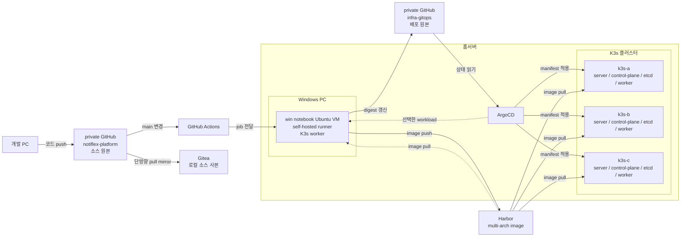
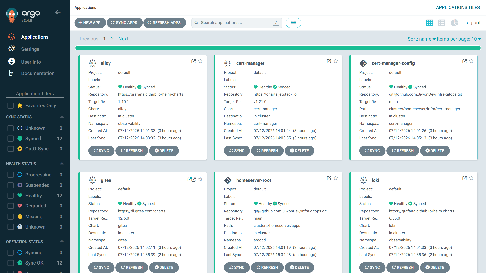
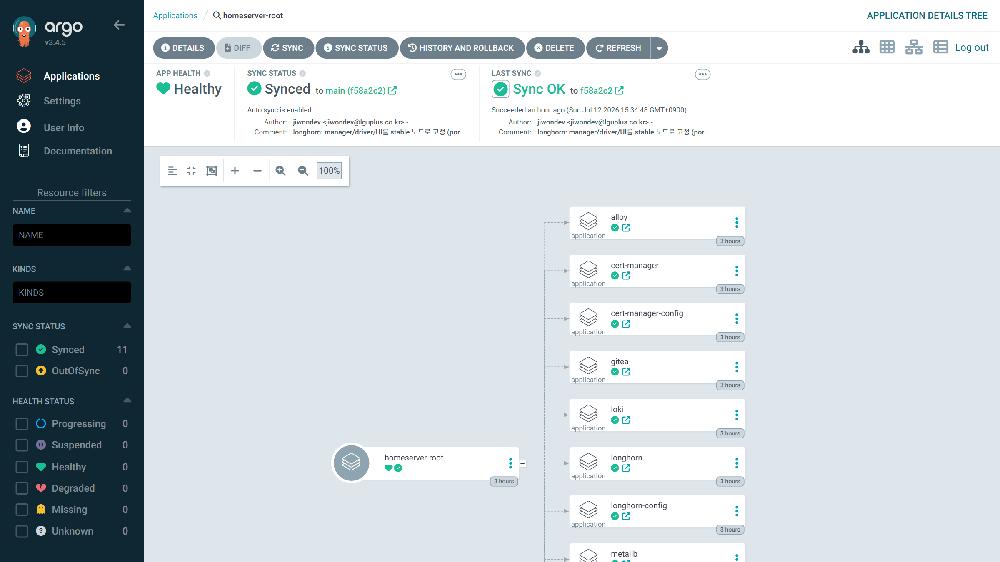

# 03 첫 번째 배포 파이프라인

2장에서 K3s와 첫 수동 배포까지 확인했습니다. 이 장에서는 Git push부터 이미지 빌드와 배포까지를 자동화합니다.

2장에서 사용한 Harbor를 이미지 저장소로 이어갑니다. 앱 소스 원본은 private GitHub `JiwonDev/notiflex-platform`이고 배포 원본은 `JiwonDev/infra-gitops`입니다. Gitea는 인터넷 단절에 대비해 GitHub를 8시간 주기로 복제하는 단방향 pull mirror로만 사용합니다.

현재 적용된 K3s 클러스터와 Harbor를 기반으로, 이 장에서는 Notiflex의 배포·promotion·rollback 흐름을 구성하고 검증합니다.



실행 명령 [chapters/assets/03-deployment-pipeline/commands.md](assets/03-deployment-pipeline/commands.md)

---

## 3.1 푸시 기반 배포의 한계

`kubectl edit`이나 `set image`로 직접 바꾼 값은 빠르게 반영되지만 변경 이유와 복구 기준이 Git에 남지 않습니다. 배포 상태는 Git commit으로 기록하고 ArgoCD만 클러스터를 Git 상태에 맞추게 합니다.

긴급 변경을 직접 실행했다면 같은 변경을 Git에 반영하고 `Synced / Healthy`가 될 때까지 임시 상태로 관리합니다.

---

### 🏠 [3.1] 홈서버 적용

| 대상 | 기준 |
| --- | --- |
| 앱 소스 | private GitHub `JiwonDev/notiflex-platform` |
| 이미지 | Harbor의 immutable manifest digest |
| 배포 상태 | private GitHub `JiwonDev/infra-gitops` |

집 안의 terminal 하나에서만 바꾼 상태는 다른 PC나 재부팅 뒤에 복구하기 어렵습니다. 직접 변경은 장애 확산을 막는 경우에만 허용하고 정상 배포 경로는 `infra-gitops`로 되돌립니다.

---

## 3.2 ArgoCD 설치 및 GitOps 연결

배포 컨트롤러는 ArgoCD 하나만 사용합니다. `Sync`는 Git과 클러스터의 차이를 나타내고 `Health`는 실행 상태를 나타냅니다.
child Application에는 `prune: true`와 `selfHeal: true`를 적용합니다. root app은 연쇄 삭제를 막기 위해 `prune: false`를 유지합니다.

---

### 🏠 [3.2] 홈서버 적용

ArgoCD는 read-only deploy key로 `git@github.com:JiwonDev/infra-gitops.git`을 읽습니다. root와 child Application의 `repoURL`도 같은 SSH URL을 사용합니다. 클러스터가 뚫려도 이 키로는 배포 원본을 바꿀 수 없습니다.
UI는 관리 PC의 `127.0.0.1:8443` port-forward로만 열고 ArgoCD admin과 K3s API를 public route로 만들지 않습니다.



원본 책의 3장은 `notiflex-smb` Application 하나를 직접 연결합니다. 여러 Application을 묶는 `root-app`은 7.3 App of Apps에서 도입합니다.

홈서버는 MetalLB, Longhorn, monitoring, Loki와 Alloy를 처음부터 함께 관리하므로 이 구조를 3장부터 사용합니다. 부트스트랩에서는 `homeserver-root` 하나만 수동 적용하고, 이후 Application 추가와 변경은 모두 `infra-gitops`에 남깁니다.

| `homeserver-root` 항목 | 값 |
| --- | --- |
| 종류 | `clusters/homeserver/bootstrap/root-app.yaml`로 생성한 Argo CD Application |
| 읽는 위치 | `infra-gitops`의 `main`, `clusters/homeserver/apps` |
| 역할 | Alloy, Longhorn, Loki 같은 child Application을 생성하고 동기화 |
| 배포 경계 | 실제 workload는 child Application이 배포 |
| 동기화 정책 | 변경 복구는 `selfHeal: true`, 연쇄 삭제 방지는 `prune: false` |



---

## 3.3 ArgoCD로 롤링 업데이트: Git push만으로 배포

ArgoCD를 연결했으므로 배포 저장소의 변경만으로 새 버전을 적용할 수 있습니다. Git push 성공은 remote가 commit을 받은 시점입니다. ArgoCD의 상태 확인과 manifest 적용, Rolling Update, readiness 확인이 끝나야 실제 배포가 완료됩니다.

`maxSurge: 1`과 `maxUnavailable: 0`은 새 Pod를 먼저 준비한 뒤 기존 Pod를 내리게 합니다. 교체 중에는 두 버전이 함께 요청을 받을 수 있으므로 API와 데이터 변경은 하위 호환이어야 합니다.

---

### 🏠 [3.3] 홈서버 적용

Notiflex는 2장에서 사용한 replica 2개로 시작합니다. `k3s-a`, `k3s-b`, `k3s-c`와 win notebook Ubuntu VM은 모두 workload를 실행할 수 있으며, 가용한 node가 여러 대면 hostname 기준으로 Pod를 분산합니다.

win notebook worker는 항상 켜 두지만 Windows 재부팅과 VM 유지보수 때는 빠질 수 있습니다. PodDisruptionBudget은 `minAvailable: 1`로 시작합니다. PDB는 drain 같은 자발적 중단을 제한할 뿐 노드 장애를 막아 주지는 않습니다.

**Probe 설정**

```yaml
readinessProbe:
  httpGet: { path: /health, port: 8080 }
  initialDelaySeconds: 5
  periodSeconds: 10
  timeoutSeconds: 1
  failureThreshold: 3
livenessProbe:
  httpGet: { path: /health, port: 8080 }
  initialDelaySeconds: 10
  periodSeconds: 20
  timeoutSeconds: 1
  failureThreshold: 3
```

3장에서는 단순하게 readiness와 liveness가 같은 `/health`를 사용합니다. 이 endpoint는 프로세스 상태와 `APP_VERSION`만 반환하고 외부 저장소는 조회하지 않습니다. readiness는 10초 간격으로 3회 실패하면 Service에서 제외하고, liveness는 20초 간격으로 3회 실패하면 컨테이너를 재시작합니다. 의존성별 준비 상태가 필요해지면 두 probe endpoint를 분리할 수 있습니다.

**배포 설정**

```yaml
spec:
  replicas: 2
  strategy:
    type: RollingUpdate
    rollingUpdate:
      maxSurge: 1
      maxUnavailable: 0
  progressDeadlineSeconds: 300
---
apiVersion: policy/v1
kind: PodDisruptionBudget
metadata:
  name: notiflex-api
  namespace: notiflex
spec:
  minAvailable: 1
  selector:
    matchLabels:
      app: notiflex-api
```

promotion commit은 다음 두 값을 함께 바꿉니다.

```yaml
# kustomization.yaml
images:
  - name: notiflex-api
    newName: harbor.home.arpa/notiflex/api
    digest: sha256:<multi-arch-manifest-digest>
configMapGenerator:
  - name: notiflex-version
    envs: [version.env]
```

```dotenv
# version.env
APP_VERSION=sha-<source-commit-12자리>
```

Deployment는 생성된 ConfigMap을 읽습니다.

```yaml
envFrom:
  - configMapRef:
      name: notiflex-version
```

Argo CD가 이 commit을 읽고 두 Pod의 Rolling Update를 끝낸 뒤 `Synced / Healthy`, Pod `Ready`, `/health`의 source SHA를 확인합니다.

---

## 3.4 GitHub Actions CI: 빌드 자동화

롤링 업데이트가 자동화되어도 test와 이미지 빌드가 수동이면 배포 파이프라인은 완성되지 않습니다. GitHub Actions는 검증을 통과한 commit으로 이미지를 만듭니다. SHA tag는 source commit을 찾는 표식이고 실제 배포에는 변경되지 않는 manifest digest를 사용합니다.

---

## 3.5 CI와 ArgoCD 연결: 빌드부터 배포까지

CI가 이미지를 만든 뒤에도 배포 저장소의 image 값을 사람이 바꾸면 수동 단계가 남습니다. CI는 이미지를 만들고 배포 저장소를 갱신하며 ArgoCD만 Kubernetes 리소스를 바꿉니다.

workflow는 `main` promotion에 concurrency를 적용해 이전 실행을 취소하고, promotion 직전에 실행 대상 SHA가 최신 `main`인지 다시 확인합니다. promotion push가 거절되면 최신 `main`을 받은 뒤 render와 schema를 다시 검증하고 한 번만 재시도합니다. conflict나 두 번째 거절은 실패로 남깁니다.

---

### 🏠 [3.4, 3.5] 홈서버 적용

| 단계 | 홈서버 설정 |
| --- | --- |
| runner | 항상 켜 두는 win notebook Ubuntu VM에서 self-hosted runner를 실행한다. kubeconfig와 Argo CD token은 두지 않는다. |
| build | BuildKit으로 `arm64`와 `amd64` 이미지를 Harbor에 push한 뒤 Trivy로 검사한다. |
| promotion | Trivy 검사를 통과한 multi-arch digest만 `infra-gitops`의 image digest와 `version.env`에 기록하고 `kubectl`은 실행하지 않는다. |
| deploy | Argo CD가 Git 변경을 읽어 K3s에 배포한다. Gitea는 배포 원본이 아닌 GitHub pull mirror로만 사용한다. |
| 확인 | Actions 성공, Harbor digest, Argo CD `Synced / Healthy`, `/health`의 source SHA를 확인한다. |

---

## 3.7 3장 가드레일 살펴보기

가드레일은 도구 선택, 실행 범위, 완료 결과를 단계별로 확인합니다.

---

### 🏠 [3.7] 홈서버 적용

원본 가드레일의 질문은 유지하고 GKE, Artifact Registry, GitHub-hosted runner를 홈서버 구성에 맞게 바꿉니다.

**실행 가드레일**

| 원본 가드레일 | 질문 | 홈서버판 답 |
| --- | --- | --- |
| [GitOps 도구 선택과 ArgoCD 설치](../gitaiops/_book-gitaiops/prompt-guardrails/ch3/3.2-argocd.md) | 배포 상태를 어디에서 읽는가 | ArgoCD만 private GitHub `infra-gitops`를 읽는다. root app은 `prune: false`, child는 `prune: true`와 `selfHeal: true`를 사용한다. `homeserver-v2` kubeconfig 파일의 `default` context를 명시한다. |
| [Rolling Update 선택과 실행](../gitaiops/_book-gitaiops/prompt-guardrails/ch3/3.3-rolling-update.md) | 첫 변경과 rollback을 어떻게 확인하는가 | 최상위 multi-arch digest를 배포 원본에 기록한다. revision, Sync, rollout, Health, `/health` 순서로 확인하고 rollback은 promotion commit을 revert한다. |
| [CI 도구 선택과 GitHub Actions 실행](../gitaiops/_book-gitaiops/prompt-guardrails/ch3/3.4-github-actions.md) | image를 어디에서 만드는가 | private GitHub의 신뢰된 `main` event만 win notebook self-hosted runner에서 실행한다. fork PR은 이 runner에서 실행하지 않는다. Harbor에는 ARM64와 amd64를 함께 push한다. |
| [CI와 ArgoCD 연결](../gitaiops/_book-gitaiops/prompt-guardrails/ch3/3.5-ci-argocd.md) | build 결과를 어떻게 배포로 연결하는가 | CI는 private GitHub `infra-gitops`의 digest와 version만 갱신한다. kubeconfig 없이 Git까지만 변경하고 ArgoCD만 K3s를 조정한다. |

**결과 확인**

| 원본 결과 | 홈서버에서 확인할 결과 |
| --- | --- |
| [ArgoCD](../gitaiops/_book-gitaiops/result-templates/ch3/3.2-argocd.md) | root와 child Application이 `Synced / Healthy`이고 repo URL이 private GitHub `infra-gitops`다. 관리 endpoint는 public route에 없다. |
| [Rolling Update](../gitaiops/_book-gitaiops/result-templates/ch3/3.3-rolling-update.md) | replica 2개가 `Ready`이고 새 version과 rollback 뒤 이전 version이 확인된다. worker가 여러 대라면 Pod 분산도 확인한다. |
| [CI](../gitaiops/_book-gitaiops/result-templates/ch3/3.4-github-actions.md) | source SHA와 workflow run이 연결되고 Harbor manifest에 ARM64와 amd64가 모두 있다. runner에는 kubeconfig가 없다. |
| [CI와 ArgoCD](../gitaiops/_book-gitaiops/result-templates/ch3/3.5-ci-argocd.md) | source SHA부터 workflow run, OCI digest, promotion commit, ArgoCD revision, `/health` version까지 한 흐름으로 이어진다. |

**실행 경계**

| 경계 | 허용하지 않는 동작 |
| -- | --- |
| Git 원본 | Gitea mirror에 먼저 commit하거나 mirror에서 GitHub `main`으로 자동 역방향 push |
| 인터넷 단절 | Gitea mirror를 새 원본으로 바꾸고 promotion을 완료 처리 |
| cluster | `homeserver-v2` kubeconfig 파일을 지정하지 않거나 `default`가 아닌 context에서 `kubectl` 실행 |
| runner | fork PR 실행, kubeconfig 저장, cluster-admin이나 ArgoCD admin 권한 부여 |
| image | `latest` 배포, 단일 architecture image, tag만 기록하고 최상위 digest 폐기 |
| GitOps | CI의 `kubectl apply`, `infra-gitops` force push |
| 관리 | ArgoCD, Gitea admin, K3s API를 public route로 공개 |
| 완료 보고 | 실제 출력 없이 `Running`, `Synced`, `Healthy`, rollback 성공으로 기록 |

다음 값이 모두 연결되고 promotion commit을 revert해 이전 version까지 복구되어야 3장이 끝납니다.

1. private GitHub `notiflex-platform`의 source SHA
2. 해당 SHA로 시작한 GitHub Actions run
3. Harbor의 ARM64와 amd64 최상위 manifest digest
4. 같은 digest를 기록한 private GitHub `infra-gitops` promotion commit
5. 해당 commit을 읽은 ArgoCD revision
6. `homeserver-v2` kubeconfig로 확인한 rollout 완료와 `/health` version
7. revert 뒤 이전 digest와 version 복구

---
