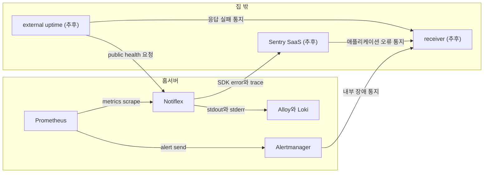
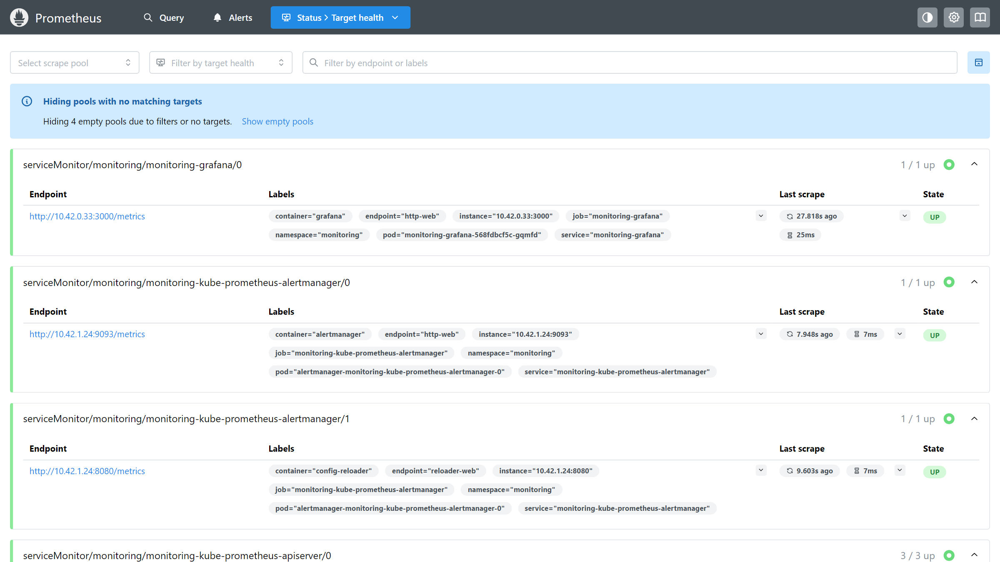
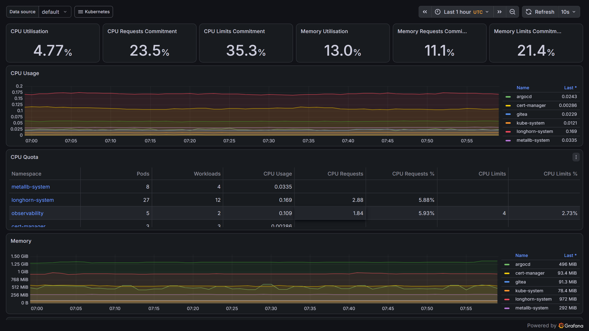
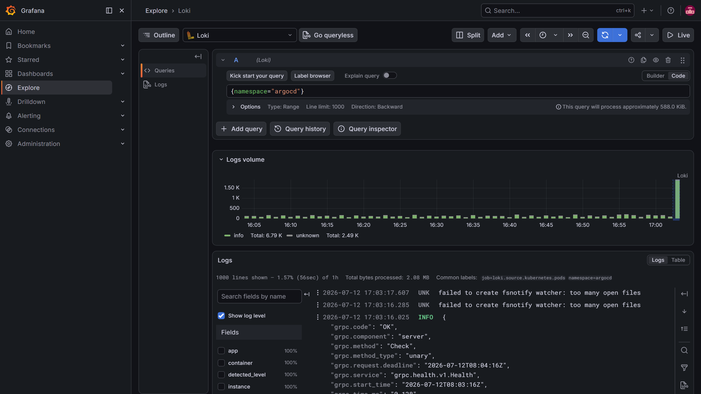

# 04 관측 가능성 구축하기

Argo CD가 `Synced / Healthy`를 보여 줘도 서비스 정상까지 보장하지는 않습니다. Pod가 `Running`이어도 자원 고갈, 애플리케이션 오류, 노드 불안정이 진행될 수 있습니다.

## 4장에서 사용하는 구성 요소

| 구성 요소 | 역할 |
| --- | --- |
| [kube-prometheus-stack](https://github.com/prometheus-community/helm-charts/blob/main/charts/kube-prometheus-stack/README.md) | Prometheus, Grafana, Alertmanager와 Kubernetes metric 수집 구성을 함께 설치하는 Helm chart입니다. |
| [Prometheus](https://prometheus.io/docs/introduction/overview/) | 시간에 따라 변하는 metric을 수집하고 저장하며 alert rule을 평가합니다. |
| [Grafana](https://grafana.com/docs/grafana/latest/introduction/) | Prometheus metric과 Loki log를 조회하고 dashboard로 보여 줍니다. |
| [node-exporter](https://github.com/prometheus/node_exporter) | Ubuntu VM과 K3s node의 CPU, memory, filesystem 같은 OS metric을 제공합니다. |
| [kube-state-metrics](https://github.com/kubernetes/kube-state-metrics) | Deployment, Pod, node 같은 Kubernetes object 상태를 metric으로 제공합니다. |
| [Alertmanager](https://prometheus.io/docs/alerting/latest/alertmanager/) | Prometheus alert를 묶고 중복을 제거한 뒤 설정한 receiver로 전달합니다. |
| [Longhorn](https://longhorn.io/docs/latest/what-is-longhorn/) | Kubernetes PVC 데이터를 여러 storage node에 복제하는 분산 block storage입니다. |
| [Loki](https://grafana.com/docs/loki/latest/) | label을 기준으로 애플리케이션과 Kubernetes log를 저장하고 조회합니다. |
| [Alloy](https://grafana.com/docs/alloy/latest/) | 각 node의 Pod log를 수집해 Loki로 전달합니다. |
| [Sentry](https://docs.sentry.io/product/) | 애플리케이션 SDK에서 오류와 trace를 받아 코드 수준의 원인을 확인합니다. |

---

### 🏠 [공통] 홈서버 적용

| 구분 | 홈서버 적용 |
| --- | --- |
| 기존 환경 | 2장에서 만든 K3s와 Harbor를 그대로 사용한다. |
| 저장소 | Mac mini 3대의 2TB SSD를 Longhorn에 사용한다. 기본은 replica 3, Prometheus와 Loki는 `longhorn-r2`를 사용한다. |
| 내부 관측 | Prometheus와 Grafana는 node와 PVC를 확인하고 Loki는 log를 저장한다. |
| 외부 관측(추후) | Sentry SaaS로 애플리케이션 오류를 받고 외부 uptime으로 전체 중단을 확인한다. |
| Sentry 설정(추후) | DSN은 K3s Secret, environment는 `home`, release는 source SHA를 사용한다. |

---

## 4.1 관측 가능성이란

관측 가능성은 메트릭, 로그, 알림을 함께 사용해 장애의 존재와 원인을 좁히는 능력입니다. 대시보드 하나가 정상이라고 서비스 전체가 정상인 것은 아니며 관측 시스템의 장애 범위도 함께 알아야 합니다.

---

### 🏠 [4.1] 홈서버 적용

- Prometheus와 Loki도 같은 K3s에서 실행하므로 집 전원이나 LAN이 끊기면 관측도 함께 멈춥니다.
- 가정집은 전기가 끊기는 경우가 간혹 있습니다. 이때 UPS의 약 10분은 홈서버와 네트워크 장비를 정상 종료하기 위한 시간입니다.
- Longhorn 구성은 node 하나의 장애에 대한 대비이며 `node-exporter`는 Mac mini 하드웨어가 아니라 그 위의 Ubuntu VM/K3s node를 확인합니다.



현재 local stack으로 내부 원인을 찾습니다. 같은 홈서버 장애에 함께 멈추는 한계는 추후 Sentry와 external uptime으로 보완합니다.

---

## 4.2 메트릭 모니터링: Prometheus와 Grafana

Prometheus는 시간에 따른 수치를 수집하고 Grafana는 이를 조회합니다. 현재 사용량만 보여 주는 도구와 달리 이력, 대시보드, 알림 평가에 필요한 데이터를 남깁니다.

---

### 🏠 [4.2] 홈서버 적용

**4.2.1 수집 범위**

| 도구 | 적용 범위                                        |
| --- |----------------------------------------------|
| Prometheus | node, Pod, PVC, 재시작 횟수와 이후 추가할 `/metrics` 수집 |
| Grafana | Prometheus metric과 Loki log 조회               |
| Alertmanager | 현재 규칙 평가와 alert 상태 확인, 추후 외부 receiver 연결     |
| Sentry SaaS(추후) | 애플리케이션 오류와 trace 관측, 추후 Sentry를 연결해도 node와 PVC metric은 Prometheus에 남깁니다.                        |


**4.2.2 저장 위치와 보관 기간**

Mac mini 3대의 내부 SSD를 K3s PVC로 사용하고, Pod가 다른 stable node로 옮겨져도 같은 데이터를 다시 연결하기 위해 Longhorn을 선택했습니다.

Longhorn StorageClass의 `allowVolumeExpansion`을 켜면 PVC를 온라인으로 늘릴 수 있습니다. 줄이는 것은 지원하지 않으므로 처음부터 최대 크기로 만들지는 않습니다.

| 선택지 | 장점 | 이 구성에서의 판단 |
| --- | --- | --- |
| Longhorn | K3s 연동이 단순하고 node 간 복제, snapshot, PVC 확장을 지원 | 기본 replica 3, 재수집 가능한 Prometheus와 Loki는 replica 2로 사용 |
| `local-path` | 가장 단순하고 빠름 | node가 멈추면 PVC도 멈추므로 임시 데이터에만 사용 |
| NAS와 NFS | 용량 추가와 외부 backup에 편리함 | NAS가 단일 장애점이 될 수 있고 Prometheus TSDB의 직접 저장소로는 사용하지 않음 |
| Rook과 Ceph | block, file, object storage를 함께 제공 | 기능과 운영 부담이 현재 홈서버보다 큼 |
| OpenEBS Mayastor | NVMe 기반 복제와 높은 성능을 지향 | storage node에 x86-64가 필요해 ARM64 Mac mini 구성과 맞지 않음 |

Longhorn에는 node 장애 뒤에도 다시 붙어야 하는 단기 운영 데이터만 저장합니다.

| 저장함 | 저장하지 않음 |
| --- | --- |
| Prometheus TSDB, Loki index와 chunk | 장기 metric과 원본 log |
| Grafana 내부 DB, Alertmanager 상태 | Longhorn volume의 유일한 backup |
| 복구에 필요한 짧은 snapshot | 대용량 첨부 파일과 장기 archive |

| 구성 요소 | 현재 값 | 확장 시 계획 |
| --- | --- | --- |
| Prometheus | 50Gi, 15일, `longhorn-r2`, retention size limit 없음 | PVC를 늘릴 때 보관 기간과 size limit을 함께 정함 |
| Loki | 50Gi, 14일, `longhorn-r2` | 로그가 급증하면 보관 기간 또는 수집량을 줄임 |
| Grafana | 10Gi, `longhorn` | 필요할 때 확장 |
| Alertmanager | 5Gi, `longhorn` | 필요할 때 확장 |


**4.2.3 K3s target 설정**

| target | 설정 |
| --- | --- |
| API server, kubelet | 인증된 scrape가 성공할 때 활성화 |
| embedded etcd | 세 server의 인증 endpoint를 확인한 뒤 활성화 |
| scheduler, controller-manager | loopback 전용이면 비활성화하고 values에 이유 기록 |

설정한 target은 Prometheus 화면에서 `UP`이어야 합니다.



**4.2.4 확인 쿼리**

Longhorn PVC가 `Bound`이고 다음 PromQL이 값을 반환해야 합니다.

```promql
up
kube_node_status_condition{condition="Ready",status="true"}
sum by (namespace) (kube_pod_container_status_restarts_total)
node_filesystem_avail_bytes{mountpoint="/"}
```

Grafana에서 namespace별 CPU와 memory가 보이면 수집 경로가 연결된 것입니다.



---

## 4.3 로그 수집: Loki와 Fluent Bit

메트릭이 이상 징후를 알려 주면 로그는 어떤 요청과 코드 경로에서 문제가 발생했는지 보여 줍니다. 책은 Fluent Bit를 사용하지만 수집 agent가 달라져도 중앙 저장소와 label 관리 원칙은 같습니다.

---

### 🏠 [4.3] 홈서버 적용

**Loki와 Alloy 설정**

| 구성 요소 | 설정 |
| --- | --- |
| Loki | `observability` namespace, single-binary replica 1, `longhorn-r2` PVC 50Gi, retention 14일 |
| Alloy | `observability` namespace, DaemonSet, `/var/log` read-only, 읽은 위치는 node별 hostPath에 저장 |
| GitOps | chart version, retention, datasource와 Secret 참조를 `infra-gitops`에 고정 |

Grafana의 Loki datasource는 UI에서 등록하지 않고 kube-prometheus-stack values의 `additionalDataSources`로 Git에 고정합니다. 아래 화면처럼 namespace를 선택해 실제 로그가 조회되면 수집 경로가 연결된 것입니다.



**label과 민감 정보**

| label | 처리 |
| --- | --- |
| `cluster`, `namespace`, `app`, `workload`, `container`, `node` | 조회에 필요한 범위에서 유지 |
| `pod` | Pod 교체가 많을 때 증가량을 관찰 |
| `request_id`, `trace_id`, `user_id` | label로 만들지 않고 로그 본문 field로 보관 |
| 모든 Kubernetes label 자동 복사 | 사용하지 않음 |

민감 정보는 애플리케이션에서 먼저 마스킹하고, Alloy 필터는 추후 보완합니다.

---

## 4.4 알림 설정: PrometheusRule

PrometheusRule은 알림 조건을 Git에 남기고 Alertmanager는 grouping, silence, route와 receiver 전달을 담당합니다. 규칙 평가와 실제 메시지 전달은 서로 다른 단계이므로 따로 시험합니다.

---

### 🏠 [4.4] 홈서버 적용

| 대상 | severity와 조건 |
| --- | --- |
| stable Ubuntu VM/K3s node | `NodeNotReady`, disk pressure는 `critical` |
| win notebook worker | `NodeNotReady`는 `warning` |
| Notiflex | 5분 동안 container restart 3회 이상이 1분간 유지되면 `warning` |

현재 Prometheus는 kube-prometheus-stack release label로 규칙을 선택합니다.

```yaml
prometheus:
  prometheusSpec:
    ruleSelector:
      matchLabels: { release: monitoring }
```

Notiflex 재시작 규칙은 다음 값으로 설정합니다.

```yaml
metadata:
  labels: { release: monitoring }
spec:
  groups:
    - name: notiflex
      rules:
        - alert: NotiflexContainerRestartBurst
          expr: increase(kube_pod_container_status_restarts_total{namespace="notiflex"}[5m]) > 2
          for: 1m
          labels: { severity: warning }
```

외부 receiver 연결은 추후 진행합니다. Sentry SaaS와 알림 채널의 credential은 `monitoring` namespace의 existing Secret으로 참조합니다.

---

## 집 밖 관측 경로

홈서버 전체가 멈추면 내부 관측 도구도 알림을 보낼 수 없습니다.

---

### 🏠 [외부 관측] 홈서버 적용

추후 공개 `/health`는 Cloudflare cache 없이 외부 uptime 서비스에서 확인하고, 애플리케이션 오류는 Sentry SaaS로 보냅니다.

Sentry를 홈서버에 직접 설치하면 자원을 사용하면서 장애 때 함께 멈춥니다. 따라서 self-hosted Sentry는 사용하지 않습니다.

---

## 4.6 4장 가드레일 살펴보기

4장 가드레일은 메트릭, 로그, 알림을 선택하고 설치한 뒤 실제 수집과 전달 결과를 확인하는 순서를 고정합니다.

---

### 🏠 [4.6] 홈서버 적용

원본의 GKE와 Fluent Bit 기준을 K3s, Longhorn, Alloy 기준으로 바꿉니다. `homeserver-v2.yaml` kubeconfig와 그 안의 `default` context로 실제 상태를 확인합니다.

**실행 가드레일**

| 원본 가드레일 | 질문 | 홈서버판 답 |
| --- | --- | --- |
| [메트릭 도구 선택과 Prometheus, Grafana 설치](../gitaiops/_book-gitaiops/prompt-guardrails/ch4/4.2-prometheus-grafana.md) | 메트릭을 어디에 저장하고 어떻게 확인하는가 | kube-prometheus-stack을 Argo CD로 관리한다. 현재 15일 retention을 확인하고 PVC 확장 때 size limit도 함께 정한다. |
| [로그 도구 선택과 Loki, Alloy 설치](../gitaiops/_book-gitaiops/prompt-guardrails/ch4/4.3-loki-fluentbit.md) | 어떤 로그 수집 경로를 사용하는가 | Loki는 Longhorn에 저장하고 수집 agent는 Alloy를 사용한다. win notebook worker에는 per-node agent만 배치하며 label 수와 민감 정보 유입을 제한한다. |
| [알림 방식 선택과 PrometheusRule 설정](../gitaiops/_book-gitaiops/prompt-guardrails/ch4/4.4-alerting.md) | 규칙과 전달 경로를 어떻게 검증하는가 | 현재 PrometheusRule의 로드와 상태를 확인한다. AlertmanagerConfig와 receiver는 추후 연결해 전달을 검증한다. |

**결과 확인**

| 원본 결과 | 홈서버에서 확인할 결과 |
| --- | --- |
| [Prometheus와 Grafana](../gitaiops/_book-gitaiops/result-templates/ch4/4.2-prometheus-grafana.md) | Application과 Pod가 정상이고 Prometheus target이 의도한 범위에서 `up`이다. PVC는 Longhorn에 `Bound`되고 Grafana에서 실제 metric을 조회할 수 있다. |
| [Loki와 Alloy](../gitaiops/_book-gitaiops/result-templates/ch4/4.3-loki-fluentbit.md) | Alloy DaemonSet이 대상 node에 배치되고 Loki에서 실제 workload log를 조회할 수 있다. |
| [PrometheusRule](../gitaiops/_book-gitaiops/result-templates/ch4/4.4-alerting.md) | 규칙이 Prometheus에 로드되고 alert 상태를 조회할 수 있다. receiver 도착과 `Resolved` 통지는 추후 연결 뒤 확인한다. |

**실행 경계**

| 경계 | 허용하지 않는 동작 |
| --- | --- |
| cluster | `homeserver-v2.yaml` kubeconfig 또는 그 안의 `default` context 확인 없이 명령 실행 |
| storage | Longhorn replica를 win notebook worker VM에 배치하거나 PVC 내부 파일을 직접 삭제 |
| target | 대시보드를 정상으로 보이게 하려고 K3s endpoint를 외부에 새로 공개 |
| log | token, 인증 header, 개인정보와 request body를 그대로 저장 |
| label | `request_id`, `trace_id`, `user_id`처럼 계속 늘어나는 값을 Loki label로 사용 |
| alert | 규칙 로드만 확인하고 receiver 전달까지 완료한 것으로 기록 |
| secret | webhook, token, password를 Git이나 명령 출력에 노출 |
| 완료 보고 | 실제 출력 없이 target, log 수집, `Firing`, `Resolved`를 성공으로 기록 |


**완료 체크리스트**

- [ ] K3s node와 Argo CD Application이 정상이다.
- [ ] Prometheus target, Grafana metric과 Longhorn PVC를 확인했다.
- [ ] Loki에서 실제 로그를 조회하고 민감 정보가 없는지 확인했다.
- [ ] PrometheusRule이 로드되고 alert 상태를 조회할 수 있다.

**추후 연결 계획**

- [ ] AlertmanagerConfig와 receiver를 연결해 `Firing`과 `Resolved` 통지를 확인한다.
- [ ] Sentry에서 `home` 환경의 시험 오류와 배포 SHA를 확인한다.
- [ ] 공개 서비스를 집 밖의 uptime check로 확인한다.

---
